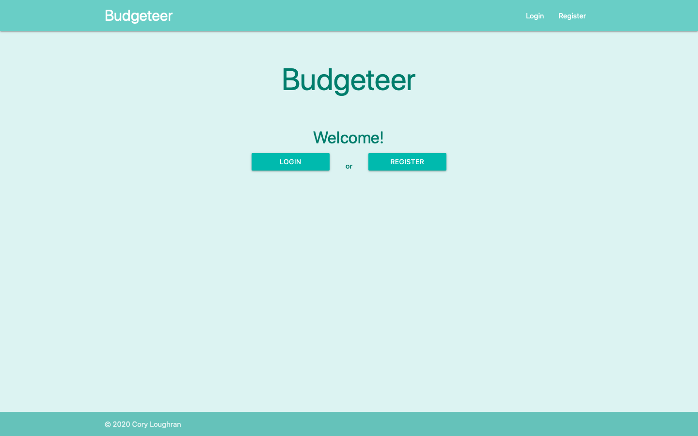
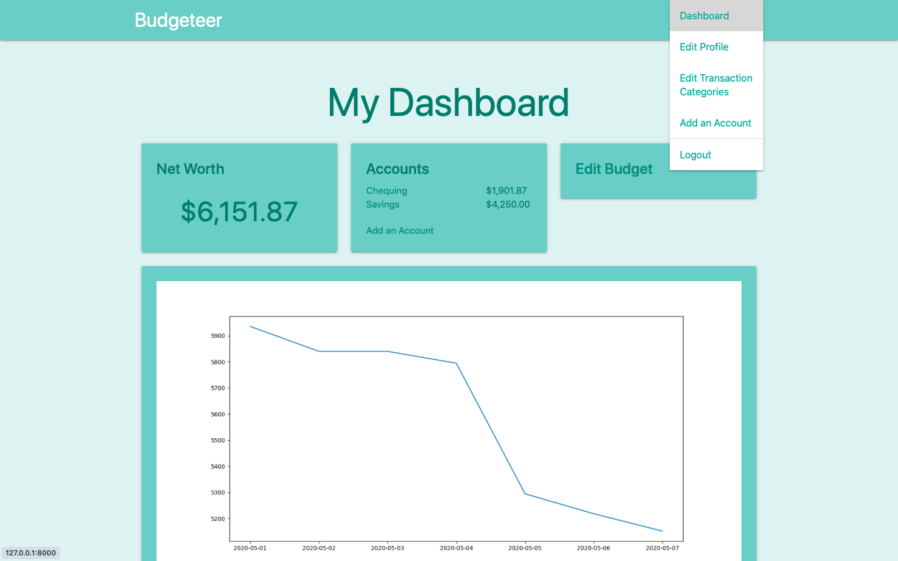

# Budgeteer

####About
After tracking my finances for the last 5 years on a cumbersome and error prone Google Sheets spreadsheet I needed a
better way to track and analyze all my expenses and investments without adding numerous new tabs to a spreadsheet. That 
is where Budgeteer comes in!

####Landing Page

####Dashboard

####Current Status
Users are able to add their accounts, post transactions, transfer funds between accounts, and adjust the value of their 
investments. 
Budgeting categories can be created and changed by the user, including archiving old categories that they may no longer 
want to use, but still want to use in historical reporting.
Net worth is tracked by aggregating transactions from across all the users accounts and a graph on the dashboard page 
visualizes the users net worth over time. 

This project is in the very early stages, more to come!